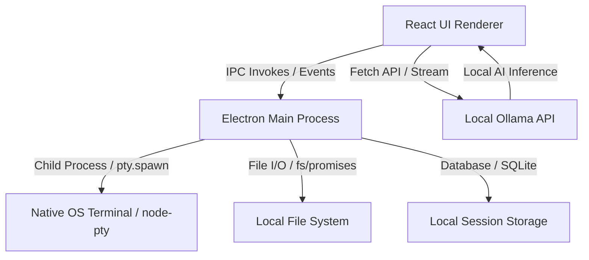

<div align="center">

  # 🌌 LocalGravity

  **A beautifully designed, privacy-first offline desktop IDE built with Electron, React, TypeScript, and Ollama.**

  [](https://opensource.org/licenses/MIT)
  [](https://www.electronjs.org/)
  [](https://reactjs.org/)
  [](https://ollama.com/)

  *LocalGravity is a completely offline local AI coding assistant and IDE, giving you the power of an autonomous coding agent directly on your local machine without requiring any paid cloud APIs or internet connection.*

</div>

---

## 📖 Table of Contents
1. [✨ Key Features](#-key-features)
2. [🏗️ Architecture Overview](#️-architecture-overview)
3. [🛠️ Workspace & IDE Capabilities](#️-workspace--ide-capabilities)
4. [🤖 AI Workflows & Assistant Modes](#-ai-workflows--assistant-modes)
   - [Plain Chat & Live Preview](#plain-chat--live-preview)
   - [Autonomous Agent Mode](#autonomous-agent-mode)
   - [Agent Tools & Functions](#agent-tools--functions)
   - [Safety & Transparency Features](#safety--transparency-features)
5. [🖥️ Technical Stack](#️-technical-stack)
6. [🚀 Getting Started](#-getting-started)
   - [Prerequisites](#prerequisites)
   - [Installation](#installation)
   - [Development Run](#development-run)
   - [Production Build](#production-build)

---

## ✨ Key Features

- **🔒 100% Private & Offline:** Runs entirely on your local machine using Ollama. No remote APIs, no telemetry, no subscription fees, and no code leaks.
- **💻 Powerful Developer Workspace:** A full-featured IDE equipped with a multi-tab Monaco editor, interactive file tree, integrated pseudo-terminal, execution runner, and Git control.
- **🤖 Autonomous Agent Mode:** A supercharged AI agent capable of recursively reading directories, rewriting code files, and running terminal commands in the workspace root.
- **🔍 Ultimate Agent Transparency:** Check step-by-step reasoning logs, track task lists, and review, accept, or reject file diffs with a clean safety rollback system.

---

## 🏗️ Architecture Overview

LocalGravity splits its operations across Electron processes to maintain a responsive user interface:



- **Renderer (React + TypeScript):** Manages editor states, open tabs, active chat panels, settings, output view, and terminal layout rendering.
- **Main Process (Electron):** Executes security validation, manages window bindings, runs target file runner sandboxes, handles OS integrations, and operates the backend PTY shell.
- **Ollama Engine:** Standard local model inference via `/api/generate` for chat and `/api/chat` with tool calling for the agent.

---

## 🛠️ Workspace & IDE Capabilities

LocalGravity provides a professional-grade editor workspace right out of the box:

* **Tabbed Editor (Monaco Editor):** Multi-tab code editor with dirty state indicators, syntax highlighting, autocomplete, search/replace, line jumps, and hotkey shortcuts.
* **File Explorer Sidebar:** Full directory tree listing with quick options to create/delete files and folders, ignoring build and git directories (`node_modules`, `.git`, `dist`, `release`) to keep scans lightweight.
* **Integrated PTY Terminal:** Powered by `node-pty` on the backend and `@xterm/xterm` on the frontend. Spawns an interactive native system terminal (`cmd.exe` on Windows or default shell on Unix) with output streaming and grid resizing support.
* **Code Execution Subsystem:** Runs supported files (`.js`, `.cjs`, `.mjs`, `.py`, `.ps1`, `.bat`, `.cmd`) on the fly, outputting system logs, stdout, and stderr live to the output console.
* **Git Panel:** Built-in Git control UI (GitView) to view modified files, stage them (`git add`), and write commits (`git commit -m`) without opening an external tool.
* **Command Palette:** Quickly navigate files, execute operations, change editor modes, or open settings via `Ctrl+Shift+P`.

---

## 🤖 AI Workflows & Assistant Modes

LocalGravity supports two primary modes of local AI assistance:

### Plain Chat & Live Preview
1. **Conversational Assistant:** Prompt engineering specifically tailored to local models. Ask coding questions, request templates, or debug issues.
2. **Planning Mode:** When enabled, the model structures its logic within `<thought>` tags before generating code or answers.
3. **Live streamed-code Editor Preview:** As the assistant streams a markdown block containing code, the editor updates in real-time to preview the incoming content.
4. **`// FILE:`-based Apply Flow:** Code blocks generated in chat with the line `// FILE: absolute_path` at the top can be applied to the filesystem with one click.

---

### Autonomous Agent Mode
Activate **Agent Mode** to allow the AI to autonomously build, test, and refactor code. It interacts with the workspace via native tool calling.

#### Agent Tools & Functions
The agent has access to a rich set of backend functions:

| Tool Name | Parameters | Purpose |
| :--- | :--- | :--- |
| `read_file` | `path` | Reads the full text of a workspace file. |
| `list_directory` | `path` | Lists files and directories in the project recursively. |
| `search_files` | `query` | Searches all files in the project for specific patterns. |
| `edit_file` | `path`, `old_text`, `new_text` | Replaces a precise, unique block of code. |
| `write_file` | `path`, `content` | Creates a new file or overwrites an existing file. |
| `delete_file` | `path` | Removes a file from the workspace. |
| `run_command` | `command` | Runs any command in the workspace directory (e.g. `npm run build`, `git status`). |
| `update_task_list` | `tasks` | Sets or updates a list of items with status (`pending`, `in_progress`, `done`). |
| `task_complete` | `summary` | Finalizes the execution flow with a concise summary. |

> [!NOTE]
> LocalGravity is built with a tool-calling fallback parser. If the selected local model (like `gemma3:4b`) does not natively support tool-calling schemas, LocalGravity automatically injects tool guidelines and parses tool calls from JSON outputs, allowing simpler models to behave as agents.

---

### Safety & Transparency Features

- **Agent Step Tracker:** Shows each step the agent takes in real-time. Inspect the exact tool called, arguments passed, status (running, done, error), and command-line outputs.
- **Task List Panel:** View the agent's current task checklist and witness items update live.
- **Pending Changes UI:** When the agent edits, creates, or deletes files, the modifications are held in a pending state. A bar at the bottom lets the user inspect file diffs and click **Accept All** to write them or **Reject All** to trigger a clean roll-back of all changes.

---

## 🖥️ Technical Stack

LocalGravity leverages a modern and robust desktop stack:

- **Core Desktop:** [Electron v26.2](https://www.electronjs.org/)
- **Frontend Framework:** [React v18.2](https://reactjs.org/) & [TypeScript](https://www.typescriptlang.org/)
- **Build & Hot-Reload:** [Vite v4.4](https://vitejs.dev/) & [Concurrently](https://github.com/open-cli-tools/concurrently)
- **Editor Widget:** [@monaco-editor/react v4.7](https://github.com/suren-atoyan/monaco-react)
- **Styling:** [Tailwind CSS v3.4](https://tailwindcss.com/) & [PostCSS](https://postcss.org/)
- **Terminal Rendering:** [xterm.js v5.3 / v6.0](https://xtermjs.org/) & [node-pty v1.1](https://github.com/microsoft/node-pty)
- **Diff Comparison:** [diff v9.0](https://github.com/kpdecker/jsdiff)
- **Database Storage:** [better-sqlite3 v12.6](https://github.com/WiseLibs/better-sqlite3)

---

## 🚀 Getting Started

### Prerequisites

1. Install [Node.js](https://nodejs.org/) (v18 or higher recommended).
2. Install [Ollama](https://ollama.com/) (runs locally on port `11434`).
3. Pull your preferred local models:
   - For standard chat/live preview: `ollama pull gemma3:4b`
   - For agent mode (requires tool-calling support): `ollama pull qwen2.5-coder` or `ollama pull llama3.1`

### Installation

Clone the repository and install all dependencies:

```bash
git clone https://github.com/sourabhnirvani/Local-Gravity.git
cd Local-Gravity
npm install
```

### Development Run

To launch the Vite development server and start the Electron application with hot-reloading:

```bash
npm run dev
```

### Production Build

To package the application and generate a standalone Windows executable (`.exe`) installer:

```bash
npm run build
```
The output setup installer will be saved in the `release/` directory.

---

<div align="center">
  Made with ❤️ by <a href="https://github.com/sourabhnirvani">Sourabh Nirvani</a>
</div>
